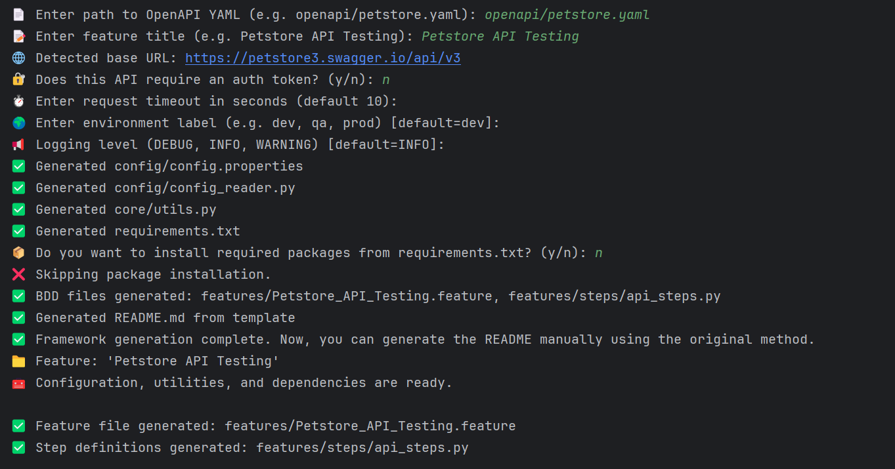

# 🧪 Petstore API Testing

This is a Python-based API test automation framework scaffolded from an OpenAPI YAML file (`openapi/petstore.yaml`).
It uses `behave` for BDD testing and `requests` for API calls.

---

## 📘 Overview

This framework auto-generates:

- ✅ `config/config.properties`: API base URL, timeout, log level, environment
- ✅ `config_reader.py`: Utility to read config values
- ✅ `core/utils.py`: Logging, headers, and request utilities
- ✅ `requirements.txt`: Required Python packages
- ✅ `README.md`: This help file

---

## 📥 Input: OpenAPI YAML

Provide a valid OpenAPI 3.x YAML file like:

```yaml
openapi: 3.0.0
info:
  title: Your API
  version: 1.0.0
servers:
  - url: https://petstore3.swagger.io/api/v3
paths:
  /resource:
    get:
      summary: Example endpoint
````

---

## 👤 Input from user

Following are the inputs user needs to give:



---

## 🚀 How to Use

```bash
python main.py
```

You will be prompted to input:

* 📄 YAML path (e.g. `openapi/petstore.yaml`)
* 📝 Feature title (e.g. `Petstore API Testing`)
* 🔐 Auth token (optional)
* ⏱️ Timeout
* 🌍 Environment
* 📢 Logging level

---

## 📁 Generated Structure

```
your_project/
├── generate_framework.py
├── requirements.txt
├── README.md
├── config/
│   ├── __init__.py
│   ├── config.properties
│   └── config_reader.py
├── core/
│   ├── __init__.py
│   └── utils.py
└── openapi/
    └── petstore.yaml
```

---

## 🛠 Requirements

Install all dependencies with:

```bash
pip install -r requirements.txt
```

Installed libraries include:

* `pyyaml`
* `requests`
* `behave`

---

## ✅ Next Steps

Once scaffolded, you can:

1. Add `.feature` files under `features/`
2. Write BDD test steps using `core/utils.py`
3. Run tests using:

```bash
behave
```

---

## 💡 Notes

* All scripts should be run from the project **root** directory.
* Relative imports like `from ..config.config_reader import ConfigReader` work because folders are treated as Python packages (`__init__.py` present).

---

## 📬 Feedback

Feel free to open issues or improve this project!

````

